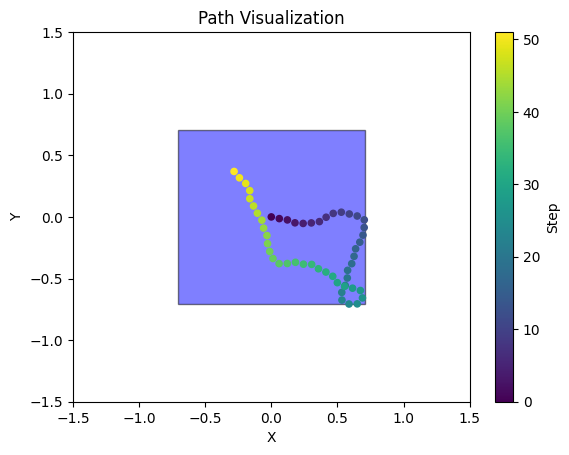
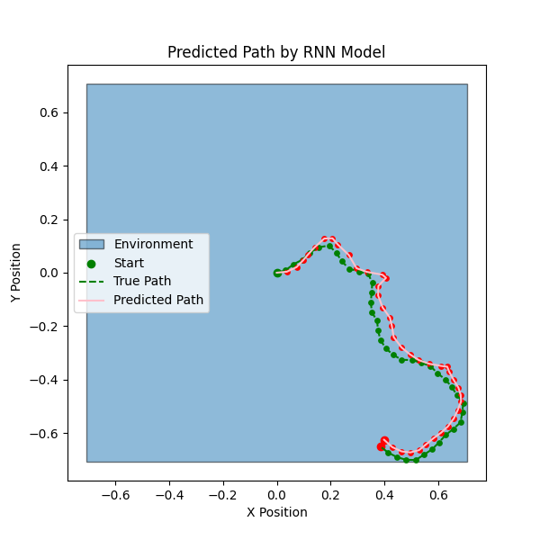
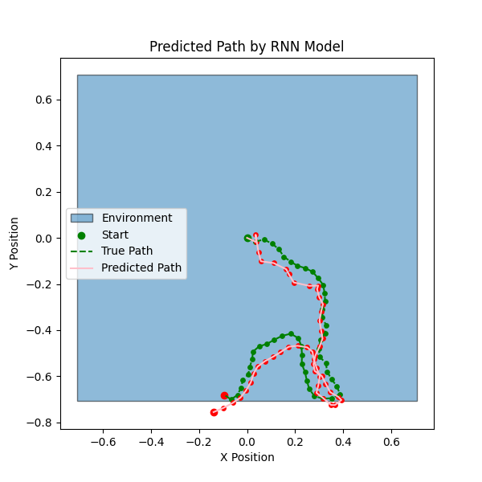
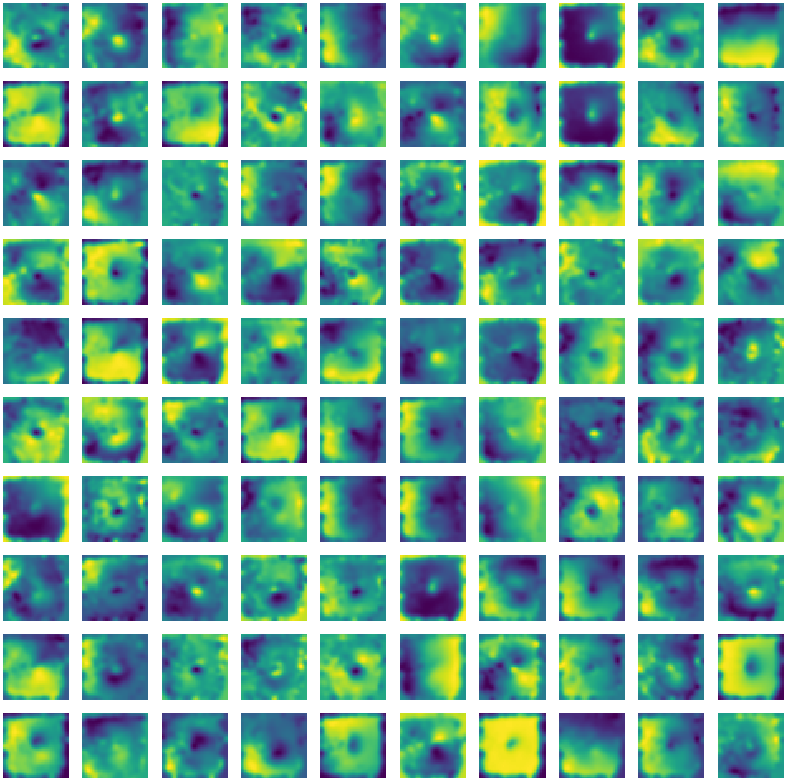

# RNN Path Integration

This project presents an implementation of the RNN path integration closely following the methodology of the original paper by Chaplot et al. (2018). The main goal of the project is to replicate and slightly modify the original approach to gain a deeper understanding of grid cells and their behavior.

# Trajectory Data Generation
The project involves generating synthetic trajectory data in a 2D environment. The agent moves within a polygonal environment, and its position is updated based on speed and heading direction inputs. The generated trajectories are used to train the RNN model for path integration.

Example trajectory:

# Results and Discussion
## Model Performance
The model performance was evaluated based on the accuracy of the predicted positions compared to the ground truth. The results showed that while the model grasped the main idea of path integration, it still tended to diverge over longer trajectories.

## Neuron Activation Patterns
The neuron activation patterns were visualized to identify grid cell-like behavior. The spatial firing maps of selected neurons were generated, however, the results did not exhibit the expected grid-like patterns as prominently as in the original paper.

The results of the project indicate that while the replication of the original paper was not entirely successful, valuable insights were gained regarding the challenges of training RNNs for path integration tasks. The report discusses the factors contributing to the results, including data generation procedures, model hyperparameter tuning, and potential deviations from the original approach.